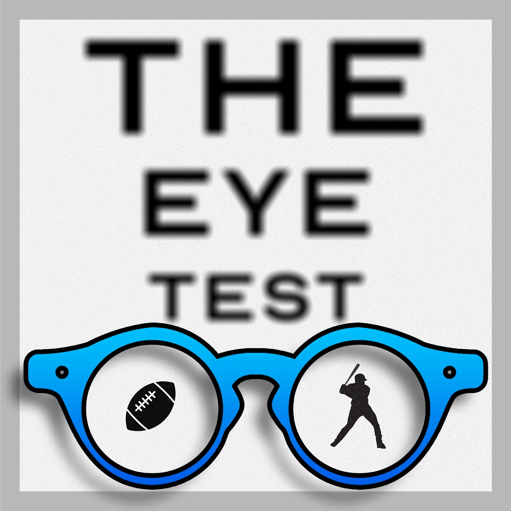
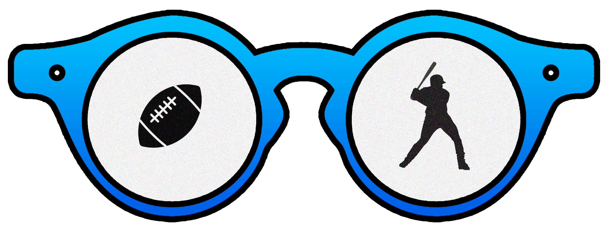

  

<h1 align="center">
  The Eye Test
</h1>

## Background

**The Eye Test** is a sports-themed podcast hosted by my good friend Brian Donovan. I built this website to showcase the podcast and also expand the brand to include a blog. The site includes the ability to playback podcast episodes, a blog fed by Contentful CMS, and general information about The Eye Test. This site and the brand may scale in the future to include a store for selling merchandise or other new functionality, so stay tuned...

## Tech Stack

- Gatsby 

- Tailwind CSS 

- Contenful 

- Netlify 

##  View it in Action!

Check out the live site at [eyetestpodcast.com](https://www.eyetestpodcast.com)
